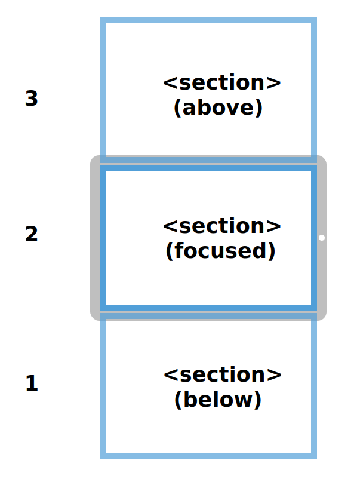
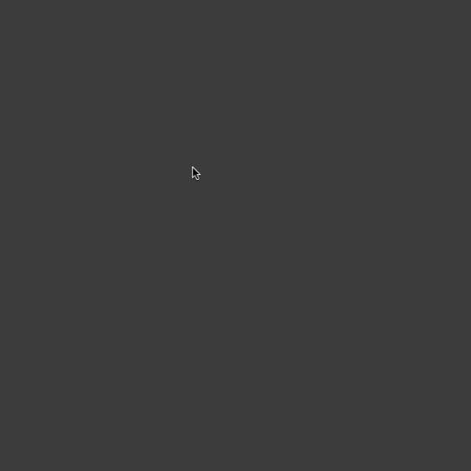
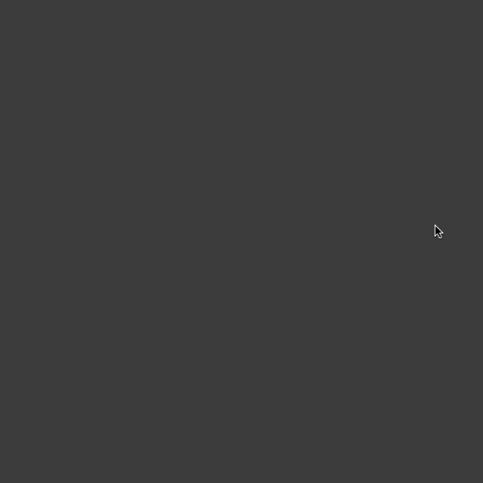
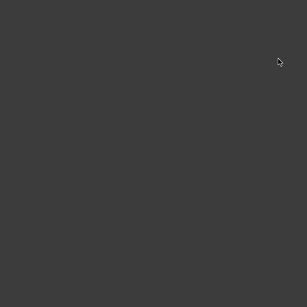
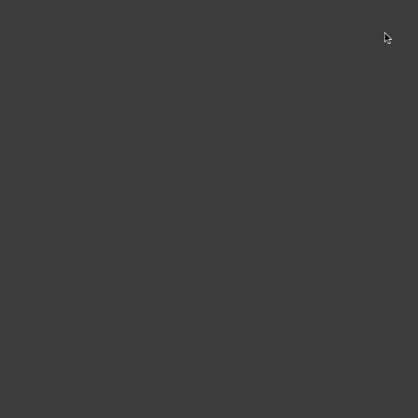

# Differences From HTML

A typical HTML page has a single top-level `<body>` tag. An HTML reel has multiple top-level `<section>` tags. Each of these sections are full screens that can be swiped through.

Sections are always at least 1 screen in length. If you want a section that is longer than a single screen, for example, to contain a long-form text article, the `--long` CSS class can be applied to the section like `<section class="--long">`. 

## CSS Scroll Variables

HTML elements within a Reel have access to special CSS variables which are automatically set and updated as the page is scrolled. Scroll variables allow you to create animation effects whose timeline is bound to the scroll position of the page, rather than the clock.

There are 8 scroll variables. They are:

```
var(--100);
var(--010);
var(--001);
var(--110);
var(--011);
var(--101);

var(--inc);
var(--dec);
```

For the 6 variables that have 1's and 0's in their name, these numbers correspond to the variable's value at the 3 keyframes of a `<section>`: *below*, *focused*, and *above*.

<p align="center">
	
</p>

The first number specifies the variable value when the section is in the *below* position, the second number specifies the value when the section is in the *focused* position, and the third number specifies the value when the section is in the *above* position.

For example, the variable `var(--010)` has the numbers 0, 1, 0. This means that the variable value will update linearly between 0 1 and 0 as the section moves from the *below* position, to the *focused* position, and finally to the *above* position. (If this seems backwards, remember that pages scroll upwards, so elements start in the below the viewport and end above it.)

Use `var(--inc)` and `var(--dec)` for steady incrementation and decrementation. The `var(--inc)` variable has a value of `-1` when the section is in the *below* position, `0`, when in the *focused* position, and `1` when in the *above* position. The `var(--dec)` variable is similar but reversed.

### Using Scroll Variables

If you want to make some text fade in as a `<section>` passes into the viewport, and fade out as a section pases out of the viewport, this can be done with simple code. Consider the following CSS:

```html
<section>
	<h1>Fade In Fade Out</h1>
</section>
```
```css
H1
{
	opacity: var(--010);
}
```

<p align="center">
	
</p>

The effect is probably too subtle in this case to be meaningful. In a practical scenario, you'll have to combine variables with CSS functions like `calc()`, `min()`, `max()`, and `clamp()`. If you apply a simple mathematical transformation to the variable to squeeze the fade slope around the middle, you can see the fading effect more clearly:

```html
<section>
	<h1>Fade In Fade Out</h1>
</section>
```
```css
H1
{
	opacity: calc((var(--010) * 3) - 2);
}
```

<p align="center">
	
</p>

There are other things you can do than fading. For example, here is an example of a title that moves from `-100vw` to `100vw` across the screen as the section is scrolled:

```html
<section>
	<h1>Movin'</h1>
</section>
```
```css
H1
{
	transform: translateX(calc(var(--inc) * 100vw));
	font-style: italic;
}
```

<p align="center">
	
</p>

## Fixed Sections

If you would prefer a section to be fixed in place for it's entire lifecycle rather than scrolling with the page, you can apply the `--fixed` CSS class to a section:

```html
<section class="--fixed">
	<h1>Solid.</h1>
</section>
```
```css
H1
{
	filter: blur(calc(var(--101) * 100px));
	opacity: calc((var(--010) * 3) - 2);
}
```

<p align="center">
	
</p>

## CSS Trigger Classes

HTML Reels can defined *trigger classes*, which are CSS classes that become available elements within a certain range of the scrolling lifecycle. Trigger classes are used to cause traditional CSS animations or CSS transitions to play at specific scroll points.

The syntax for trigger classes follows the form `class-name@start,end`. The values specified in the `start` and `end` are numbers between -1 and 1 that form a range where the class name is set on the element. Below are some syntax examples:

```html
<!--
"foo" is defined between the points when the section is fully below the viewport, to the point where the section is perfectly aligned with the viewport.
-->
<div class="foo@-1,0"></div>

<!--
"foo" is defined between the points when the section is half way below the viewport, to the point where the section is half way above the viewport.
-->
<div class="foo@-0.5,0.5"></div>

<!-- The second number may be omitted, in which case, the value is 1 -->
<div class="foo@0.5"></div>
```
